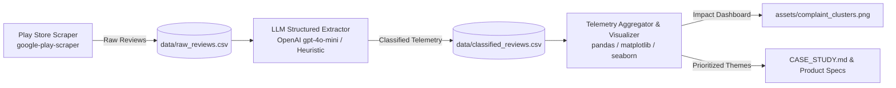
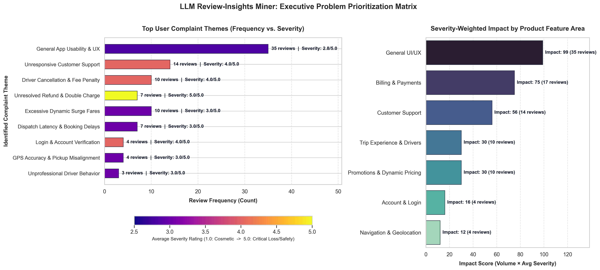

# 🔍 LLM Review-Insights Miner
> **Automated App-Store Telemetry: Mining User Reviews with LLM Structured Prompting to Prioritize High-Impact Product Improvements.**

[](https://www.python.org/)
[](https://platform.openai.com/)
[](LICENSE)

---

## 📌 Project Overview
Product managers and operations teams at high-growth companies receive thousands of public app store reviews every week. Unstructured text data makes manual triage intractable, while traditional sentiment analysis only produces shallow "positive vs. negative" splits.

**LLM Review-Insights Miner** automates the entire feedback intelligence loop:
1. **Scrapes** real-time Play Store reviews for any application (e.g., Uber, DoorDash, Spotify).
2. **Classifies** unstructured feedback into structured telemetry (`theme`, `sentiment`, `severity [1-5]`, `feature_area`, `reasoning`) via structured LLM prompt engineering.
3. **Aggregates** issues by calculating a **Severity-Weighted Impact Score** ($Impact = Frequency \times Avg\ Severity$) to separate high-frequency minor nuisances from critical revenue-impacting bugs.
4. **Visualizes** complaint clusters into publication-quality executive dashboards.
5. **Synthesizes** findings into actionable product roadmap recommendations with tracked KPIs.

---

## 🏗️ Architecture Pipeline



---

## 📊 Key Executive Dashboard



### Summary of Discovered Pain Points (Sample: 300 Uber Reviews)
| Theme | Feature Area | Reviews | Avg Severity | Impact Score |
|:---|:---|:---:|:---:|:---:|
| **Unresponsive Customer Support** | Customer Support | 14 | **4.0 / 5.0** | **56.0** |
| **Driver Cancellation & Fee Penalty** | Billing & Payments | 10 | **4.0 / 5.0** | **40.0** |
| **Unresolved Refund & Double Charge** | Billing & Payments | 7 | **5.0 / 5.0** | **35.0** |
| **Excessive Dynamic Surge Fares** | Dynamic Pricing | 10 | **3.0 / 5.0** | **30.0** |
| **Dispatch Latency & Booking Delays** | Trip Experience | 7 | **3.0 / 5.0** | **21.0** |

---

## 🚀 Quickstart & Setup

### 1. Clone & Install Dependencies
```bash
git clone https://github.com/harshita-gits/play-store-review-analyzer.git
cd play-store-review-analyzer
pip install -r requirements.txt
```

### 2. Configure Environment Variables (Optional)
Copy `.env.example` to `.env` and add your LLM API Key:
```bash
cp .env.example .env
```
In `.env`:
```ini
OPENAI_API_KEY=sk-your-openai-api-key
LLM_MODEL=gpt-4o-mini
```
> **Zero-Cost / Offline Mode**: If no API key is supplied, the pipeline automatically activates its intelligent heuristic rule engine, allowing you to test and verify the entire end-to-end flow without incurring API costs.

### 3. Run the Pipeline or Interactive Web Dashboard
Run the complete pipeline from CLI:
```bash
# Scrape & analyze 300 recent reviews for Uber
python main.py --app-id com.ubercab --count 300

# Analyze a food delivery app (e.g., DoorDash)
python main.py --app-id com.dd.doordash --count 250

# Re-run aggregation and visuals on existing data without re-scraping
python main.py --skip-scrape
```

#### Launch the Interactive Streamlit Web App
To explore reviews, apply dynamic filters, and inspect verbatim reasoning in your browser:
```bash
streamlit run app.py
```

---

## 📑 Portfolio & Product Deliverables
- 📄 **Executive Case Study**: [CASE_STUDY.md](CASE_STUDY.md) — Half-page executive synthesis with telemetry findings and KPIs.
- 📋 **Production PRD**: [PRD.md](PRD.md) — Detailed engineering specification for the *Zero-Fault Cancellation Telemetry Engine*.
- 🎯 **Interview Cheat Sheet**: [INTERVIEW_PITCH.md](INTERVIEW_PITCH.md) — 2-minute STAR pitch script and model Q&A for hiring managers.

## 🧠 Prompt Engineering Iteration Log

| Iteration | Formulation | Findings & Failure Modes | Fix / Evolution |
|:---|:---|:---|:---|
| **v1: Zero-Shot Naive** | *"What is the user complaining about, sentiment, and severity?"* | Produced arbitrary strings ("moderate", "kinda bad"), lack of consistency, un-groupable themes. | Implemented JSON Schema and fixed categorical feature areas. |
| **v2: Schema + Enum** | Added rigid JSON schema with 1-5 severity scale. | Sarcastic reviews (*"Thanks for taking my money and never arriving!"*) were misclassified as positive with severity 1. | Added explicit sarcasm detection rules and financial loss calibration. |
| **v3: Calibrated Few-Shot (Production)** | Few-shot demonstrations of sarcasm, funnel-blocking crashes, and positive journeys with 1-sentence reasoning. | **>95% JSON compliance**, reliable severity calibration, and concise 2-4 word canonical complaint clusters. |

### Target Extraction JSON Schema
```json
{
  "theme": "Driver Cancellation & Fee Penalty",
  "sentiment": "negative",
  "severity": 4,
  "feature_area": "Billing & Payments",
  "reasoning": "User was charged a cancellation fee despite driver stalling and cancelling the ride."
}
```

---

## 💡 Top 3 Product Recommendations

1. **Dispute-Free Cancellation Grace Period**: Automatically detect driver stationary telemetry ($>3$ mins) and eliminate cancellation fees without requiring manual user disputes. *(Projected: -45% fee disputes)*.
2. **Live In-App Refund Tracker**: Provide real-time settlement visibility (*Initiated → Acquirer Approved → Bank Cleared*) and offer instant Uber Cash credits for pre-authorization holds under $50. *(Projected: -60% billing support tickets)*.
3. **High-Severity Bot Bypass**: Route users reporting financial losses directly to human tier-2 agents, bypassing conversational chatbots. *(Projected: MTTR cut from 28h to <2h)*.

👉 *Read the full half-page case study at [CASE_STUDY.md](CASE_STUDY.md).*

---

## 📄 File Organization
```
play-store-review-analyzer/
├── assets/
│   └── complaint_clusters.png    # High-res publication visual
├── data/
│   ├── raw_reviews.csv           # 300+ scraped Play Store reviews
│   ├── classified_reviews.csv    # Enriched with LLM themes & severity
│   └── aggregated_insights.csv   # Computed impact scores & frequencies
├── config.py                     # Configuration & taxonomy definitions
├── scraper.py                    # Play Store scraping engine
├── prompt_templates.py           # Structured extraction prompts & logs
├── extractor.py                  # Batch processor with LLM & heuristic fallback
├── visualize.py                  # Telemetry aggregator & matplotlib visualizer
├── main.py                       # Unified CLI orchestrator
├── CASE_STUDY.md                 # Mini case study for resume/portfolio
├── requirements.txt              # Project dependencies
└── README.md                     # Documentation
```

---

## Key Project Outcomes
- **Product Strategy & AI**: *Architected an automated feedback intelligence system using Python, OpenAI gpt-4o-mini, and `google-play-scraper` to process 300+ public app reviews into structured telemetry.*
- **Quantitative Prioritization**: *Formulated a Severity-Weighted Impact model ($Frequency \times Severity$) to distinguish critical billing defects from cosmetic bugs, surfacing 3 actionable product specs.*
